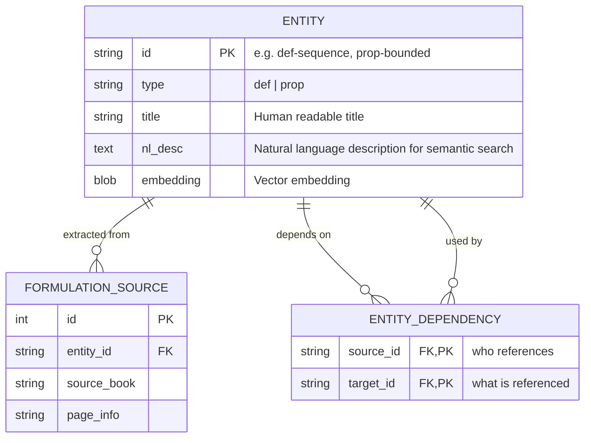

# Architecture & Design

## 1. Formal Entity-Relationship Model

### 1.1 Logical Model (Entities)

The system strictly adheres to Lean's paradigm by categorizing all mathematical concepts into two primary types:

1. **`def`**: Objects, structures, definitions, axioms, operations, and functions. Anything that constructs data or sets a foundational premise.
2. **`prop`**: Properties, theorems, lemmas, and corollaries. Anything that asserts truth and is expected to have a proof (or is a proposition).

*Note on Axioms*: Axioms are treated as `def` entities. They can optionally use the `% lean_manual: true` flag in their LaTeX source to indicate that they are foundational and should not be processed by the automated Lean code generator.



### 1.2 SQL Physical Schema (SQLite)

```sql
CREATE TABLE IF NOT EXISTS entities (
    entity_id TEXT PRIMARY KEY,
    type TEXT NOT NULL CHECK(type IN ('def', 'prop')),
    title TEXT NOT NULL,
    path TEXT NOT NULL,
    file_path TEXT,
    lean_path TEXT,
    nl_desc TEXT,
    embedding BLOB
);

CREATE TABLE IF NOT EXISTS formulation_sources (
    id INTEGER PRIMARY KEY AUTOINCREMENT,
    entity_id TEXT NOT NULL REFERENCES entities(entity_id),
    source_book TEXT NOT NULL,
    page_info TEXT
);

CREATE TABLE IF NOT EXISTS entity_dependency (
    source_id TEXT REFERENCES entities(entity_id),
    target_id TEXT REFERENCES entities(entity_id),
    PRIMARY KEY (source_id, target_id)
);
```


### 1.3 Reading the Diagram

| Relationship | Cardinality | Rationale |
|---|---|---|
| `OBJECT ↔ PROPERTY` | **M:N + context** | `prop-bounded` применимо к разным объектам; `context` указывает условия |
| `OPERATION → OPERATION_ARGUMENT` | 1:N | Поддержка N-арных операций |
| `OPERATION → OBJECT (codomain)` | N:1 | Каждая операция имеет один тип результата |
| `THEOREM ↔ OBJECT/PROPERTY/OPERATION/AXIOM` | M:N | Через junction tables |
| `THEOREM → THEOREM (parent_of)` | 1:N self | Лемма принадлежит ровно одной теореме |
| `THEOREM → THEOREM (dependency)` | **M:N (DAG)** | Логические зависимости |
| `OBJECT ↔ OBJECT (equivalence)` | M:N sym. | Эквивалентные определения, с proof_id |
| `OBJECT → OBJECT (composition)` | 1:N | Объект-контейнер |
| `ENTITY → ENTITY (entity_dependency)` | **M:N (DAG)** | Перекрёстные ссылки `\entityref` в `content/` |
| `BOOK → FORMULATION` | 1:N | Книга предоставляет N формулировок |
| `ENTITY ← FORMULATION` | 1:N | Сущность может иметь N формулировок из разных книг |

---

## 2. Three-Layer Content Architecture

### 2.1 Overview

```
┌────────────────────────────────────────┐
│  Layer 1: content/                     │  Канонические сущности
│  Одна формула на сущность              │  (source of truth for WHAT)
│  \entityref{id}{text} — гиперссылки    │  → entity_dependency таблица
├────────────────────────────────────────┤
│  Layer 2: sources/                     │  Транскрипции учебников
│  .tex по разделам                      │  (source of truth for HOW)
├────────────────────────────────────────┤
│  Layer 3: \label{entity:ID}            │  Линковка
│  внутри source .tex файлов             │  (maps Layer 2 → Layer 1)
└────────────────────────────────────────┘

Pipeline:  content/ + sources/  →  parser.py  →  seed_from_content.py  →  SQLite  →  web/
```

### 2.2 Layer 1: `content/` — Canonical Entities

```
content/
├── mathesis.sty                        ← shared preamble
├── mathesis_macros.sty                 ← Auto-generated semantic macros
├── master.tex                          ← master doc → PDF with hyperlinks
│
├── defs/
│   ├── Set [def-set].tex
│   ├── Sequence [def-sequence].tex
│   ├── Cartesian Product [def-cartesian-product].tex
│   └── Negation [axiom-negation].tex
│
└── props/
    ├── Bounded [prop-bounded].tex
    ├── Continuity [prop-continuous].tex
    └── Weierstrass Extreme Value [prop-weierstrass-extreme-value].tex
```

> [!IMPORTANT]
> **Pure Math Absolute Rule.** Канонические файлы в `content/` НЕ ДОЛЖНЫ содержать
> текста на естественном языке (русском, английском и т.д.) в определениях. Внутри
> `\begin{definition}` / `\begin{theorem}` допускаются **исключительно**
> математические символы в LaTeX math mode.
> Доказательства (`\begin{proof}`) могут содержать текст.

> [!CAUTION]
> **Semantic Macros Rule.** Хардкод LaTeX-примитивов (например, `\mathbb{R}`, `\sup`, `\in`) **ЗАПРЕЩЕН**. Все сущности, определенные в `defs/` или `props/`, получают автоматически сгенерированный PascalCase макрос в `mathesis_macros.sty` (например, `\RealNumbers`, `\Supremum`, `\ClosedInterval`). LLM обязана использовать эти динамические макросы. Старая нотация `\mType` полностью признана устаревшей и больше не используется.


### 2.3 Cross-References: `\entityref`

Файлы в `content/` ссылаются друг на друга через `\entityref{id}{text}`.

**Пакет** `content/mathesis.sty`:

```tex
\ProvidesPackage{mathesis}
\RequirePackage{hyperref}
\RequirePackage{amsmath, amssymb, mathtools}
\newcommand{\entityref}[2]{\hyperref[entity:#1]{#2}}
```

**Мастер-документ** `content/master.tex` собирает все файлы → один PDF с рабочими гиперссылками:

```tex
\documentclass[a4paper]{article}
\usepackage{mathesis}
\begin{document}
\input{foundations/Axiom of Extensionality [axm-zfc-extensionality]}
\input{objects/Set [obj-set]}
% ...
\end{document}
```

**Пример использования** в файле сущности:

```tex
% entity-id: obj-function
% entity-type: object
\section{definition}
\label{entity:obj-function}

\Forall{\entityref{obj-set}{X},\; \entityref{obj-set}{Y}}
\text{\textit{функция}} \; f \colon X \to Y
\mDefIff
f \subset \entityref{obj-cartesian-product}{X \times Y} \;\land\;
\forall\, x \in X \;\; \exists!\, y \in Y \colon\quad (x, y) \in f
```

**Парсер** извлекает зависимости:

```python
import re
def extract_dependencies(content: str) -> list[str]:
    return list(set(re.findall(r'\\entityref\{([^}]+)\}', content)))
```

Результат: `['obj-set', 'obj-cartesian-product']` → записывается в `entity_dependency`.

**Обратные ссылки** (`used_by`) вычисляются API-запросом:
```sql
SELECT source_id FROM entity_dependency WHERE target_id = ?;
```

### 2.4 Layer 2: `sources/` — Textbook Transcriptions

```
sources/
├── _registry.yaml
├── zorich-1/
│   ├── _meta.yaml
│   ├── ch03s01-sequences.tex
│   └── ...
└── rudin/
    ├── _meta.yaml
    └── ch03-sequences.tex
```

Определения/теоремы внутри source `.tex` помечены `\label{entity:ID}`:

```tex
\begin{definition}
\label{entity:prop-convergent}
Число $A$ называется пределом последовательности $\{x_n\}$, если
для любого $\varepsilon > 0$ найдётся номер $N$...
\end{definition}
```

> [!IMPORTANT]
> `\entityref` используется **только** в `content/` (канонические определения).
> Файлы `sources/` содержат `\label{entity:ID}` для линковки с Layer 1, но **не** используют `\entityref`.

---

## 3. Semantics: Lemma (Model A)

**Lemma** — вспомогательное утверждение, принадлежащее ровно одной родительской теореме.

### Rules

1. `subtype: lemma` ⟹ `parent_theorem_id` **NOT NULL**
2. Лемма не может существовать без родительской теоремы
3. Если лемма оказывается полезной в другом контексте — она **повышается** до `subtype: theorem`
4. Связь: `THEOREM ||--o{ THEOREM : "parent_of"` — одна теорема -> 0..N лемм

### File Convention

Лемма именуется с префиксом родительской теоремы:

```
BW Bisection [lemma-bw-bisection].tex
BW Subsequence Extraction [lemma-bw-subseq].tex
```

---

## 4. File Naming Convention

### 4.1 Format

```
Human Name [id].tex
```

### 4.2 Rules

1. **Human Name** — English, Title Case, spaces allowed
2. **`[id]`** — lowercase, alphanumeric, hyphenated, prefixed by type: `obj-`, `prop-`, `op-`, `thm-`, `lemma-`, `axm-`. Digits are allowed to prevent collisions of similarly named objects (e.g., `obj-sequence-1`, `prop-bounded-2`).
3. No nested folders inside entity directories (flat)

### 4.3 Parsing Rule

```python
import re

def parse_filename(filename: str):
    match = re.match(r'^(.+?) \[([a-z0-9\-]+)\]\.tex$', filename)
    if match:
        return {"name": match.group(1), "id": match.group(2)}
```

---

## 5. Book Naming Convention (Standardized)

**Format:** `Author - Title - (LANG) - [Year].pdf`

- **Author:** Фамилия И.О. (на латинице).
- **Title:** Название книги (на английском).
- **LANG:** `(EN)` или `(RU)`.
- **Year:** `[2021]` или `[10th ed]`.

**Examples:**
- `Zorich V.A. - Mathematical Analysis I - (RU) - [2012].pdf`
- `Rudin W. - Principles of Mathematical Analysis - (EN) - [1976].pdf`

---

## 6. Canonical Notation Rules

All `\section{definition}` / `\section{statement}` in `content/` use these rules:

### Quantifiers & Logic

| Rule | Canonical Macro (`mathesis.sty`) | Avoid |
|---|---|---|
| Quantifiers | `\Forall{x}`, `\mExists{x}` | `\forall x`, `\exists x` |
| Separator | `\;\;` (or built-in to macro) | comma, colon |
| Colon before condition | `\colon` + `\quad` | plain `:` |
| Implication | `\mImplies` | `\Rightarrow`, `\implies` |
| Iff | `\mIff` | `\Longleftrightarrow`, `\iff` |
| Def-equal | `\mDefIff` | `:=`, `\stackrel{\text{def}}{\Longleftrightarrow}` |

### Sets & Numbers

| Rule | Canonical Macro (`mathesis.sty`) | Avoid |
|---|---|---|
| Number sets | `\mReal`, `\mNatural`, `\mInteger`, `\mRational` | `\mathbb{R}`, `\mathbb{N}` |
| Empty set | `\mEmpty` | `\varnothing`, `\emptyset` |
| Set builder | `\mSet{x \in X \mid P(x)}` | `\{x : P(x)\}` |

### Variables

| Rule | Canonical |
|---|---|
| Sequence members | $x_n$, $a_n$ (lowercase Latin) |
| Index | $n, m, k$ (for ℕ) |
| Epsilon | `\varepsilon` (never `\epsilon`) |
| Limit value | $A$ (uppercase) |

### Layout

| Rule | Canonical |
|---|---|
| One concept per definition | no conjunctions |
| Display math only | no inline in definitions |
| **No natural language (absolute)** | **Запрещён любой текст на естественном языке внутри `content/`. `\text{}` допускается только для стандартных математических терминов (e.g. `\text{sgn}`, `\text{const}`). Описания на русском/английском языке генерируются исключительно в `result.tex` инструментом `pipeline/generate_answer.py`.** |
| Proof end | `\mQED` |

---

## 7. API Architecture

### 7.1 Layer Diagram

```
┌────────────────────────────────────────────────────┐
│              Transport layers                       │
│  ┌────────┐  ┌──────────┐  ┌────────────────────┐  │
│  │  Web   │  │   CLI    │  │  Desktop (future)  │  │
│  │ FastAPI│  │ argparse │  │  Qt / Tauri        │  │
│  └───┬────┘  └────┬─────┘  └────────┬───────────┘  │
│      │            │                 │               │
│      └────────────┴─────────────────┘               │
│                     │                               │
├─────────────────────┼───────────────────────────────┤
│                     ▼                               │
│           MathesisDB (core.py)                      │
│           ┌─────────────────┐                       │
│           │  Facade class   │                       │
│           └─────┬───────────┘                       │
│        ┌────────┼────────┬──────────┐               │
│        ▼        ▼        ▼          ▼               │
│     db.py   queries.py  validator.py  parser.py     │
│     (DDL)   (read)      (check)       (tex→model)  │
│        │        │        │             │            │
│        └────────┴────────┴─────────────┘            │
│                     │                               │
│              SQLite (mathesis_index.db)              │
└────────────────────────────────────────────────────┘
```

### 7.2 MathesisDB Public API

```python
class MathesisDB:
    # --- Lifecycle ---
    def connect() -> None
    def close() -> None
    def init_db() -> None
    def reset_db() -> None

    # --- CRUD: Entities ---
    def get_axiom(id) -> Axiom
    def get_object(id) -> Object
    def get_property(id) -> Property
    def get_operation(id) -> Operation
    def get_theorem(id) -> Theorem
    def list_axioms() -> list[Axiom]
    def list_objects(module?) -> list[Object]
    def list_properties(module?) -> list[Property]
    def list_operations(module?) -> list[Operation]
    def list_theorems(module?, subtype?) -> list[Theorem]
    def create_axiom(Axiom) -> Axiom
    def create_object(Object) -> Object
    def create_property(Property) -> Property
    def create_operation(Operation) -> Operation
    def create_theorem(Theorem) -> Theorem

    # --- Relationships ---
    def get_object_properties(object_id) -> list[ObjectProperty]
    def get_operation_arguments(op_id) -> list[OperationArgument]
    def get_lemmas(theorem_id) -> list[Theorem]
    def get_dependencies(theorem_id) -> list[Theorem]

    # --- Cross-References (\entityref) ---
    def get_entity_dependencies(entity_id) -> list[str]   # what this entity references
    def get_entity_dependents(entity_id) -> list[str]     # who references this entity

    # --- Backlinks ---
    def get_used_by(entity_id) -> UsedByResult

    # --- Graph ---
    def trace_to_axioms(theorem_id) -> list[TraceNode]
    def get_full_dag() -> list[TheoremDependency]

    # --- Equivalences & Composition ---
    def get_equivalents(object_id) -> list[Equivalence]
    def get_components(object_id) -> list[ObjectComposition]
    def get_containers(component_id) -> list[Object]

    # --- Formulations (NEW) ---
    def get_formulations(entity_id) -> list[Formulation]
    def list_books() -> list[Book]

    # --- Search ---
    def search(query, entity_type?) -> list[SearchResult]

    # --- Catalog ---
    def list_modules() -> list[str]
    def list_by_module(module) -> dict

    # --- Validation ---
    def validate() -> ValidationReport

    # --- Junction helpers ---
    def link_theorem_object(theorem_id, object_id) -> None
    def link_theorem_property(theorem_id, property_id) -> None
    def link_theorem_operation(theorem_id, operation_id) -> None
    def link_theorem_axiom(theorem_id, axiom_id) -> None
    def link_theorem_dependency(theorem_id, used_thm_id, proof_step?) -> None
    def link_object_property(object_id, property_id, context?, context_ref?) -> None
    def add_operation_argument(OperationArgument) -> None
    def add_equivalence(a_id, b_id, proof_id?) -> None
    def add_composition(ObjectComposition) -> None
    def add_formulation(Formulation) -> None       # NEW
    def register_book(Book) -> None                # NEW
```

### 7.3 Web Routes (FastAPI)

| Method | Path | Description |
|---|---|---|
| GET | `/` | Homepage — entity counts, module list |
| GET | `/axioms/{id}` | Axiom detail + formulations |
| GET | `/objects/{id}` | Object detail + properties + formulations |
| GET | `/properties/{id}` | Property detail + formulations |
| GET | `/operations/{id}` | Operation detail + arguments + formulations |
| GET | `/theorems/{id}` | Theorem + proof + lemmas + DAG trace + formulations |
| GET | `/modules/{module}` | All entities in module |
| GET | `/search?q=...` | FTS search |
| GET | `/graph` | Full theorem DAG visualization |
| GET | `/books` | List of source books |
| GET | `/books/{key}` | Book detail + all formulations |

---

## 8. N-ary Operation Example

| Operation | Arity | Arg 0 | Arg 1 | Codomain |
|---|---|---|---|---|
| `op-limit-seq` (Предел) | 1 | `obj-sequence` | — | `obj-real-numbers` |
| `op-addition` (Сложение) | 2 | `obj-real-numbers` | `obj-real-numbers` | `obj-real-numbers` |
| `op-composition` (Композиция) | 2 | `obj-function` | `obj-function` | `obj-function` |
| `op-derivative` (Производная) | 1 | `obj-function` | — | `obj-function` |

---

## 9. Dynamic Compiler (Генератор ответов)

Канонические файлы в `content/` хранят **только** строгую математику (см. Pure Math Absolute Rule в Разделе 2.2). Для формирования человекочитаемого ответа используется отдельный инструмент.

### 9.1 Инструмент: `pipeline/generate_answer.py`

Скрипт выполняет следующий цикл:

1. **Сбор формул.** Читает запрошенные `.tex` файлы из `content/`, извлекает чистую математику из `\[ ... \]` и метаданные (`defined-in`, `entity-type`).
2. **Линковка с учебниками.** По метаданным `defined-in` определяет источник из `sources/_registry.yaml` и добавляет в вывод ссылку на учебник и страницу.
3. **Синтез естественного языка.** Транслирует строгую математическую запись в человекочитаемый текст (русский язык + формулы), используя LLM или шаблонизированный подход.
4. **Формирование `result.tex`.** Генерирует итоговый файл в формате `\documentclass{report}` со структурой `\chapter` / `\section`.
5. **Компиляция.** Вызывает `pdflatex` для сборки `result.pdf`.

### 9.2 Формат вывода

Формулировки в `result.tex` **допускают и приветствуют** использование естественного языка вперемешку с математическими формулами. Это единственное место в системе, где математика и слова объединяются.

```tex
\section{Окрестность точки}
\textbf{Источник:} Зорич В.А., Том I, стр. 42
\[ U_\varepsilon(x_0) = \mSet{x \mIn \mReal \mid |x - x_0| < \varepsilon} \]
$\varepsilon$-окрестностью точки $x_0$ называется множество всех вещественных чисел,
удаленных от $x_0$ на расстояние строго меньше $\varepsilon$.
```

---

## 10. Ensemble Extraction & Synthesis Pipeline

Начиная с версии 2.0 конвейер переведен на ансамблевый метод агрегации данных из нескольких источников для достижения математической полноты.

### 10.1 Стадии конвейера
1. **Extraction (Агрегация)** (`pipeline/ensemble_extractor.py`)
   - Извлекает сырые определения из списка учебников (`sources/_registry.yaml`).
   - Использует механизм **Sliding Context Window** (глубина окна: от начала параграфа до самого определения), чтобы не упустить неявные ограничения (например, ограниченность функции).
   - Сохраняет результат во временную таблицу БД `formulation_raw_cache`.

2. **Alignment (Выравнивание)** (`pipeline/entity_aligner.py`)
   - Прогоняет извлеченные тексты через локальную модель эмбеддингов Ollama (`nomic-embed-text`).
   - Использует библиотеку **FAISS** (`IndexFlatIP`) для быстрой векторной кластеризации (косинусное сходство).
   - Назначает схожим определениям общий `cluster_id`.

3. **Synthesis (Синтез)** (`pipeline/canonical_synthesizer.py`)
   - Передает весь кластер (включая предшествующий контекст) в LLM.
   - LLM выявляет скрытые ограничения (implicit constraints) и синтезирует единый строгий канонический файл `.tex`, строго соблюдая *Pure Math Absolute Rule*.
   - Сохраняет файл в `content/` и удаляет временные записи из `formulation_raw_cache`.

4. **Linking (Связывание)** (`pipeline/link_content.py`)
   - Парсит мета-тег `% defined-in:` из `.tex` файлов и создает записи в `formulation_sources`, связывая каноническую сущность со списком использованных книг.
   - Автоматически прописывает ссылки `\entityref` с использованием `\ensuremath`, чтобы защитить математический контекст.

---

## 11. Terminal Primitives & `content/terminals/`

Терминальные примитивы (Terminal Primitives) — это фундаментальные математические символы (листья в DAG), которые определены либо аксиоматикой ZFC, либо логикой первого порядка (FOL).

### 11.1 Правила терминалов
- **ЗАПРЕЩЕНО** оборачивать их макросом `\entityref`.
- **НЕ генерируют** ребер в графе зависимостей `entity_dependency`.
- Жестко закодированы в `pipeline/terminals.py` (`\forall`, `\in`, `\land`, `\emptyset` и т.д.).

### 11.2 Директория `content/terminals/`
Для предоставления человекочитаемых описаний терминалов используется специальная директория `content/terminals/`.
- **Исключение из Pure Math Rule**: В файлах этой директории разрешено использование естественного языка (комментарии, метафоры, примеры).
- **Исключение из Lean Export**: Скрипт трансляции `export_to_lean.py` полностью игнорирует эту директорию, так как для Lean терминалы являются встроенными константами.

---

## 12. Late Binding & Abstract Parametric Macros

Архитектура использует паттерн "Позднее связывание" (Late Binding) для разрешения полиморфизма математических операций (например, норма вектора, абсолютное значение, супремум).

### 12.1 Механика макросов
Все абстрактные операции определены в `mathesis.sty` с опциональным аргументом для `entity-id`:

```latex
% #1 — optional entity-id (default = abstract interface id)
% #2 — mandatory operand
\newcommand{\mNorm}[2][op-norm-abstract]{\left\| #2 \right\|}
```

### 12.2 Разделение ответственности
1. **LLM-Экстрактор**: Генерирует только абстрактный вызов без квадратных скобок (Surface Syntax): `\mNorm{x}`.
2. **Lean Elaborator (Future)**: Анализирует типы из Strict Typing Block и выполняет Typeclass Resolution.
3. **Graph Mutator (Future)**: Возвращается к исходному `.tex` файлу и инжектирует вычисленный конкретный инстанс в опциональный аргумент: `\mNorm[op-norm-euclidean]{x}`.

---

## 13. Strict Typing Block Convention

Чтобы обеспечить корректный вывод типов в Lean 4 и работу механизма Late Binding, каждая формулировка должна содержать жесткий блок объявления типов (Strict Typing Block).

### 13.1 Правила типизации
1. Каждое определение/теорема **обязано** начинаться с блока объявления типов.
2. **Любая переменная**, используемая в `Definitional Body`, обязана быть объявлена через квантор с явным указанием её принадлежности к множеству или типу.

### 13.2 Шаблон
```latex
% ПРАВИЛЬНО (Strict Typing Block):
\Forall{f \colon \entityref{obj-closed-interval}{[a,b]} \mTo \entityref{obj-real-numbers}{\mReal}}
\Forall{\varepsilon > 0}
... (тело)

% НЕПРАВИЛЬНО:
\mAbs{f(x)} < \varepsilon  % Откуда взялись f, x, \varepsilon?
```

---

## 14. Semantic Macros and Translation Caching

В архитектуру добавлены механизмы кэширования и семантической макрогенерации для обеспечения надежности компиляции и скорости сборки.

### 14.1 Semantic Macros (`mathesis_macros.sty`)
Вместо использования регулярных выражений для парсинга и подмены `\entityref{id}{text}` в Python-коде, система перешла на нативные возможности LaTeX для разрешения зависимостей и гиперссылок.

1. **Компилятор макросов (`pipeline/macro_compiler.py`)**:
   - Сканирует все `.tex` файлы в `content/`.
   - Читает фронтматтер и извлекает поля: `% macro: \MacroName` и `% args: N`.
   - Генерирует `output/mathesis_macros.sty` с определениями макросов (например, `\newcommand{\Set}[1]{\hyperlink{obj-set}{#1}}`).
2. **Преимущества**:
   - Вычисление зависимостей (DAG) происходит путём сканирования текстов на наличие этих макросов.
   - Исключаются ошибки с неэкранированными символами и парсингом вложенных скобок.

### 14.2 Translation Caching (`nl_translations_cache.json`)
Генерация естественного языка (RU/EN параграфы) с помощью LLM (модули `generate_answer.py` и `generate_full_book.py`) кэшируется.

1. **Кэширование**:
   - Результаты синтеза (`synth_ru`, `synth_en`, `desc_ru`, `desc_en`) сохраняются в `output/nl_translations_cache.json` по ключу `entity_id`.
   - При повторной сборке `full_book.pdf` или `result.pdf` текст переиспользуется, что ускоряет сборку и экономит ресурсы LLM.

### 14.3 Formula Wrapping (`pipeline/latex_utils.py`)
Автоматический перенос длинных формул для PDF-формата A4:
- Функция `process_body_formulas` разбивает слишком длинные формулы на несколько строк.
- Формулы разбиваются строго по бинарным операторам (`\mIff`, `\mImplies`, `=`, `<`) без разрыва скобок.
- Используется окружение `flalign*` для аккуратного левого выравнивания математических выражений.
