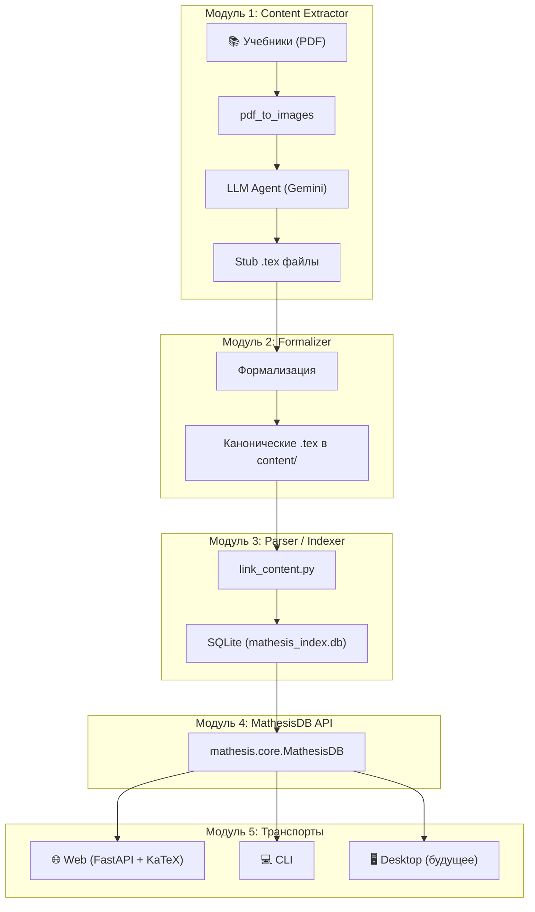
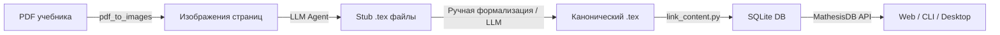

# Обзор системы

## Глобальная проблема

Написание строгих математических формулировок вручную — процесс ненадёжный и невоспроизводимый. Учебники содержат тысячи определений, теорем и доказательств, связанных неявными логическими зависимостями. Человек не способен последовательно отследить всю цепочку от теоремы до базовых аксиом ZFC.

**Mathesis** автоматизирует этот процесс:

1. Извлекает математические сущности из сканированных учебников.
2. Классифицирует их по типам (объект, свойство, операция, теорема, аксиома).
3. Формализует их — переписывает без естественного языка.
4. Строит направленный ациклический граф (DAG) зависимостей до фундаментальных аксиом.
5. Хранит всё в реляционной БД (SQLite) и предоставляет доступ через API и транспорты.

---

## Компонентная диаграмма

---

## Жизненный цикл данных

Подробнее:

1. **PDF → Изображения:** утилита `tools/pdftoimages/pdf_to_images.py` конвертирует страницы учебника в изображения для точного распознавания формул.
2. **Изображения → Stub .tex:** агент (`tools/agent/agent.py`) на базе Gemini API анализирует изображения страниц, выделяет сущности и создаёт файлы-заглушки.
3. **Stub → Канонический .tex:** формулировки заполняются в строгом формальном виде с использованием макросов из `content/mathesis.sty`.
4. **LaTeX → SQLite:** скрипт `tools/link_content.py` парсит `.tex` файлы и заполняет базу `mathesis_index.db`.
5. **SQLite → Транспорты:** класс `MathesisDB` предоставляет единый API; Web-транспорт (`web/app.py`) рендерит HTML-страницы с формулами через KaTeX.

---

## Внешние зависимости

| Зависимость | Назначение | Обязательна? |
|-------------|-----------|--------------|
| **Python ≥ 3.10** | Основной язык проекта | ✅ |
| **TeX Live / MikTeX** | Компиляция `master.tex` → PDF | ✅ |
| **SQLite ≥ 3.38** | Хранение индекса сущностей | ✅ (встроена в Python) |
| **FastAPI + Uvicorn** | Web-транспорт | Для веб-интерфейса |
| **Jinja2** | Шаблонизация HTML | Для веб-интерфейса |
| **google-genai** | Gemini API для LLM-агента | Для модуля извлечения |
| **Pillow** | Обработка изображений | Для модуля извлечения |
| **python-dotenv** | Управление секретами (API-ключ) | Для модуля извлечения |

---

## Трёхслойная архитектура контента

Проект использует трёхслойную модель данных:

| Слой | Расположение | Назначение |
|------|-------------|-----------|
| **Layer 1** | `content/` | Канонические сущности (одна формула на файл, `\entityref` для связей) |
| **Layer 2** | `sources/` | Побуквенные транскрипции из учебников (по разделам) |
| **Layer 3** | `\label{entity:ID}` | Линковка Layer 2 → Layer 1 |

Подробная ER-модель и SQL-схема — в разделе [ER-модель и схема БД](design.md).
