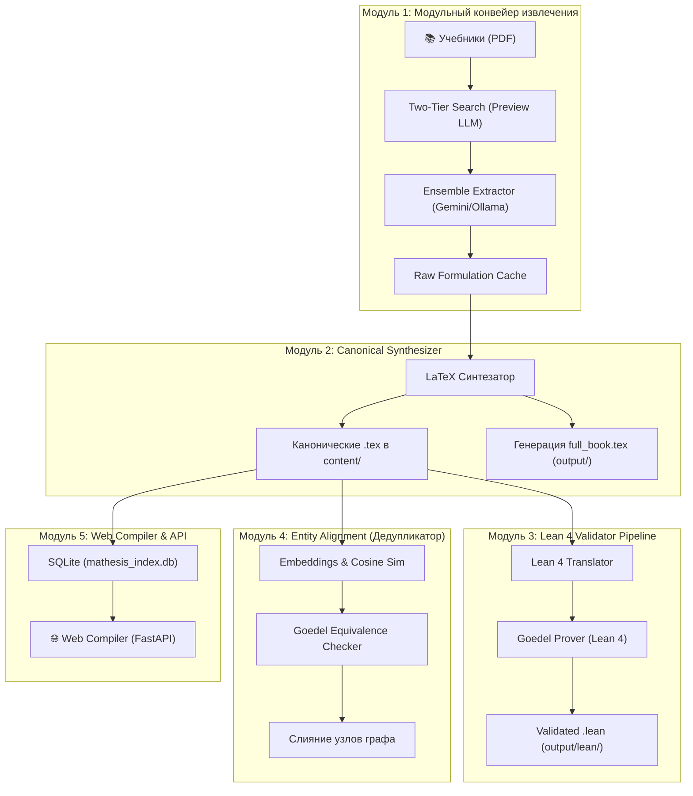

# Обзор архитектуры системы Mathesis

## Глобальная проблема

Извлечение строгих математических знаний из неструктурированных PDF-учебников и их проверка вручную — невыполнимая задача из-за объемов и неявных логических зависимостей. 

**Mathesis** решает эту проблему через многоступенчатый ИИ-конвейер:
1. Выделяет формулировки из текста и разрешает математические категории через ансамбль LLM.
2. Применяет алгоритм PDSE (Pre-emptive Dependency Semantic Extraction) с O(1) поиском по `alias_registry` и гибридным векторным поиском для разрешения зависимостей.
3. Синтезирует их в строгий LaTeX с функциональной нотацией и инжектирует маппинг правил для Lean 4.
4. Валидирует корректность типов и доказывает эквивалентность через Lean 4.
5. Выдаёт пользователю интерактивный граф и скомпилированные PDF-книги (`full_book.pdf`).

---

## Компонентная диаграмма

---

## Основные архитектурные концепции

### 1. Единый менеджер моделей (ModelManager)
Конвейер использует централизованный синглтон `pipeline.model_manager.ModelManager` для управления вызовами LLM. Архитектура построена на паттернах **Factory** и **Strategy**:
- **Модульная стратегия**: Провайдеры (Ollama, Gemini, OpenAI, Groq, HF, LlamaCpp) реализуют общий интерфейс `ModelStrategy`.
- **Ролевая система**: Вместо глобальных переменных используются роли. Модели инициализируются с привязкой к конкретной задаче, например, `main` (извлечение и синтез), `preview` (двухэтапный поиск), `lean` (валидация).
Это решает проблему конфликтов конфигураций и позволяет гибко миксовать проприетарные и локальные LLM на разных этапах пайплайна, полностью избавляясь от устаревших глобальных функций настройки.

### 2. Two-Tier Hybrid Search и PDSE (Pre-emptive Dependency Semantic Extraction)
Для экономии ресурсов API и обеспечения топологической целостности графа внедрен алгоритм PDSE:
1. **O(1) Alias Registry**: Термины сначала прогоняются через SQLite-таблицу `alias_registry` для мгновенного точного сопоставления локальных псевдонимов с каноническими ID.
2. **Preview LLM**: Быстрая легковесная модель просматривает страницы учебника и оценивает вероятность наличия на них целевой математической сущности (например, Определение Дарбу).
3. **Main Extractor**: Если Preview LLM дала высокий скор, страница передается мощному ансамблю для скрупулезного извлечения формул и восстановления неявных контекстов (например, "предположим $n \in \mathbb{N}$").
4. **Векторный поиск**: В случае промаха O(1) кэша, задействуется векторный поиск (Ollama `nomic-embed-text`) для разрешения нечетких формулировок с автоматическим отсечением зависимостей из будущего.

### 3. Функциональная нотация
Вся математика конвертируется в строгую функциональную нотацию для устранения неоднозначностей. 
Вместо $|x|$ используется макрос `\semantic macro{op-abs-abstract}{\mathrm{abs}}(x)`. 
Все сущности связываются строгими идентификаторами (начинающимися с `obj-`, `prop-`, `oper-`, `thm-`, `axm-`).

### 4. Lean 4 Validator Pipeline & Universe Mapping
Синтезированный LaTeX автоматически транслируется в код Lean 4. Для повышения вероятности успеха применяется Lean Universe Mapping:
- **STRUCTURE** -> `class` / `structure`
- **MAPPING** -> `def` (возвращающий `Type`)
- **PREDICATE** -> `def` (возвращающий `Prop`)
- **THEOREM/AXIOM** -> `theorem` / `axiom`

Система проверяет корректность через `LeanReplManager` — долгоживущий процесс `lake exe repl`. Общение с ним происходит через JSON API (`stdin`/`stdout`), что позволяет:
- Однократно компилировать и держать в памяти тяжелый кэш `Mathlib` (ускорение валидации в 30-40 раз).
- Мгновенно валидировать синтаксическую правильность и типизацию (Type Mismatch).
- Инкрементально извлекать сигнатуры через `#check`.

При успешной валидации сигнатура Lean кода прописывается в `% lean-signature:` метаданных LaTeX-файла, а сам код сохраняется в `output/lean/`.

### 5. Entity Alignment Tooling
Алгоритм `postprocess_equivalence.py` решает проблему дубликатов:
1. Вычисляет векторные представления (Embeddings) формулировок (например, через `nomic-embed-text`).
2. Находит пары-кандидаты с высоким косинусным сходством (> 0.90).
3. Формирует теорему эквивалентности и просит `Goedel Prover` доказать её в Lean 4.
4. В случае успешного доказательства физически сливает `.tex` файлы и обновляет все ссылки в базе `mathesis_index.db`.
